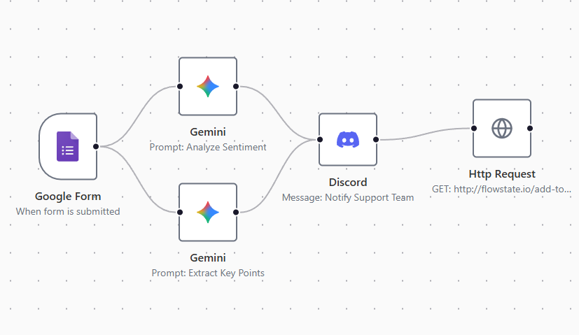

# Flowstate - AI-Native Workflow Automation Platform

[](https://nextjs.org/)
[](https://www.typescriptlang.org/)
[](https://trpc.io/)
[](https://www.inngest.com/)
[](https://tailwindcss.com/)
[](https://www.prisma.io/)

**Flowstate** is a powerful, drag-and-drop workflow automation platform designed to bridge the gap between traditional logic and Generative AI. Built with **Next.js 15** and powered by **Inngest** for durable execution, it allows users to construct complex, reliable automation pipelines that integrate third-party services (Stripe, Discord, Slack) with LLMs (OpenAI, Anthropic, Gemini).

---

## 🚀 Live Demo

**Experience the automation platform live:** [https://flowstate-two.vercel.app/](https://flowstate-two.vercel.app/)

> _Note: The application is deployed on Vercel Edge Network for low latency. Feel free to explore the visual editor and node configurations._

### 🔑 Demo Credentials

To explore the admin panel and workflow builder without signing up, use these credentials:

- **Email:** `demo@flowstate.dev`
- **Password:** `demouser123`

## 📸 Workflow Studio



> _Design complex logic flows visually. Connect triggers to AI agents and external APIs seamlessly._

---

## ⚡ Key Features

- **Visual Workflow Builder:** Interactive, node-based editor built on **React Flow** and **XYFlow**, supporting drag-and-drop connections and real-time state management.
- **Durable Execution Engine:** Leveraging **Inngest**, workflows are resilient to failures, support automatic retries, and can run for minutes or hours without timing out (Serverless-ready).
- **End-to-End Type Safety:** Utilizing **tRPC**, the communication between the visual editor and the backend is 100% type-safe, reducing runtime errors and improving developer velocity.
- **AI-Native Integrations:** First-class support for **OpenAI, Anthropic, and Gemini**. Users can chain AI outputs into downstream actions (e.g., "Analyze Stripe Refund reason -> Draft Email").
- **SaaS Ready Architecture:**
  - **Authentication:** Secure implementation via **Better Auth**.
  - **Monetization:** Integrated **Polar.sh** for subscription management (Pro/Free tiers).
  - **Security:** AES-256 encryption for storing sensitive user credentials (API Keys) via `cryptr`.
- **Real-time Observability:** Integrated with **Sentry** for error tracking and performance monitoring.

---

## 🛠 Tech Stack & Architecture

This project adopts a modern, edge-compatible architecture focused on reliability and developer experience.

### Frontend

- **Framework:** Next.js 15 (App Router, Server Actions).
- **State Management:** Jotai (global client state) & Nuqs (URL state management).
- **UI Components:** Shadcn/ui (Radix Primitives) + Tailwind CSS v4.
- **Canvas:** React Flow (Custom nodes for Triggers and Actions).

### Backend & Infrastructure

- **API Layer:** tRPC (Edge-compatible).
- **Database:** PostgreSQL (NeonDB) accessed via Prisma ORM.
- **Event Bus:** Inngest (Handles async jobs, flow execution, and concurrency).
- **Auth:** Better Auth (Github/Google Social Login + Email/Pass).

### Flow Execution Logic

When a workflow runs, Flowstate uses a **Topological Sort algorithm** to determine the execution order of nodes, ensuring dependencies (like AI outputs) are resolved before dependent actions (like Discord notifications) are fired.

---

## 🚀 Getting Started

### Prerequisites

- Node.js 20+
- PostgreSQL Database (or Neon.tech)
- Redis (Optional, for local Inngest dev server persistence)

### Installation

1.  **Clone the repository**

    ```bash
    git clone https://github.com/yourusername/flowstate.git
    cd flowstate
    ```

2.  **Install Dependencies**

    ```bash
    npm install
    ```

3.  **Environment Setup**

    ```bash
    cp .env.example .env
    # Fill in DATABASE_URL, BETTER_AUTH_SECRET, INNGEST_EVENT_KEY, etc.
    ```

4.  **Database Migration**

    ```bash
    npx prisma migrate dev
    ```

5.  **Run Development Server**
    This project uses `mprocs` to run Next.js, Inngest Dev Server, and Ngrok simultaneously.
    ```bash
    npm run dev:all
    ```
    - App: `http://localhost:3000`
    - Inngest Dashboard: `http://localhost:8288`

---

## 🧪 Testing & Linting

- **Linting:** `npm run lint` (ESLint 9 configuration).
- **Type Check:** `tsc --noEmit`.

---

## 📝 License

This project is open-sourced software licensed under the [MIT license](https://opensource.org/licenses/MIT).
